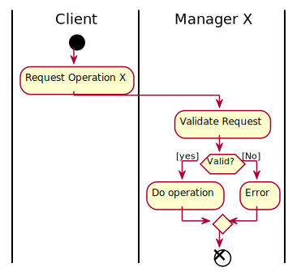
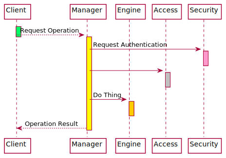

[#use-cases]
== Use Cases

_Specify how the system is required to operate as opposed to what it should do._

The main use case of this software system is to; _Do X_. All other use cases are derivations from this main use case.

=== Top level Use Case X

==== Sub case A
Description.

The activity diagram:

The sequence diagram:

